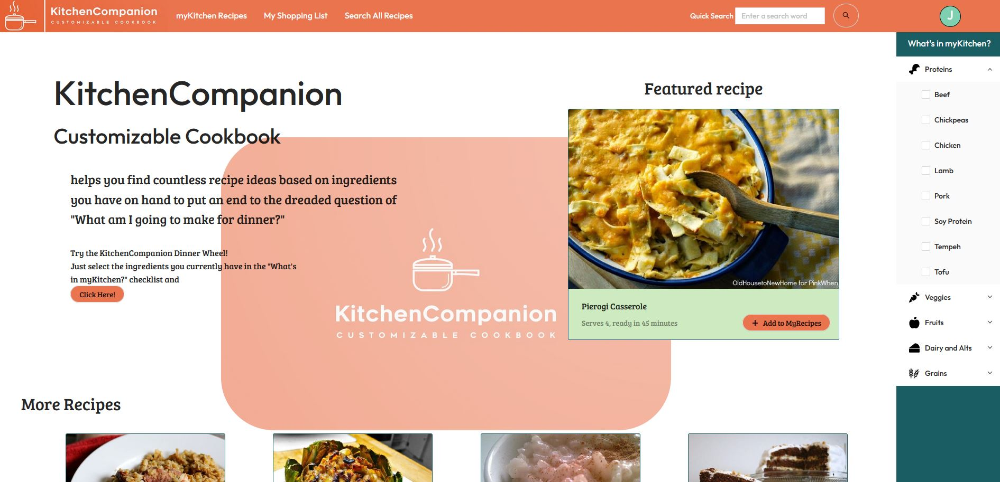
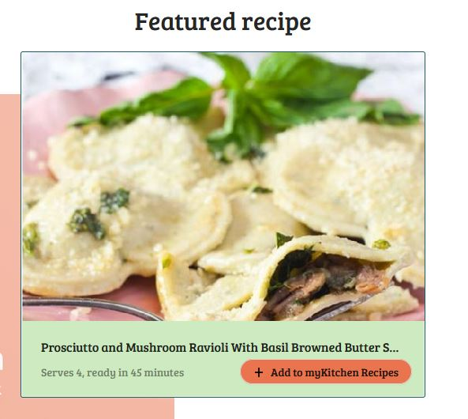
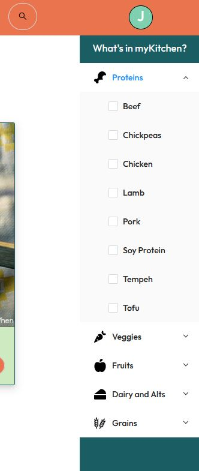
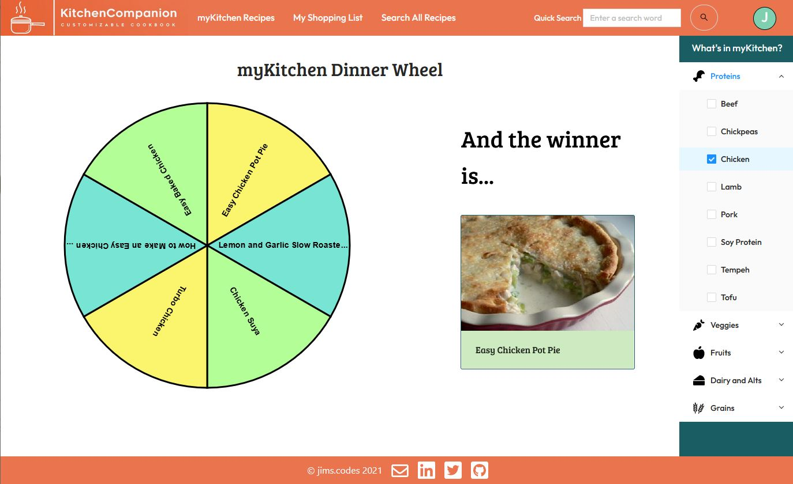
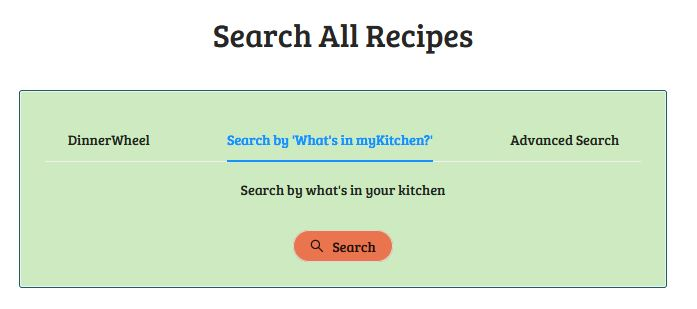
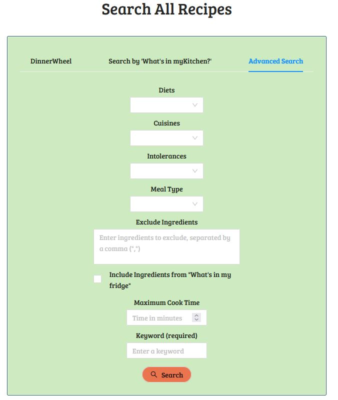
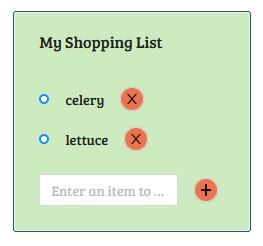
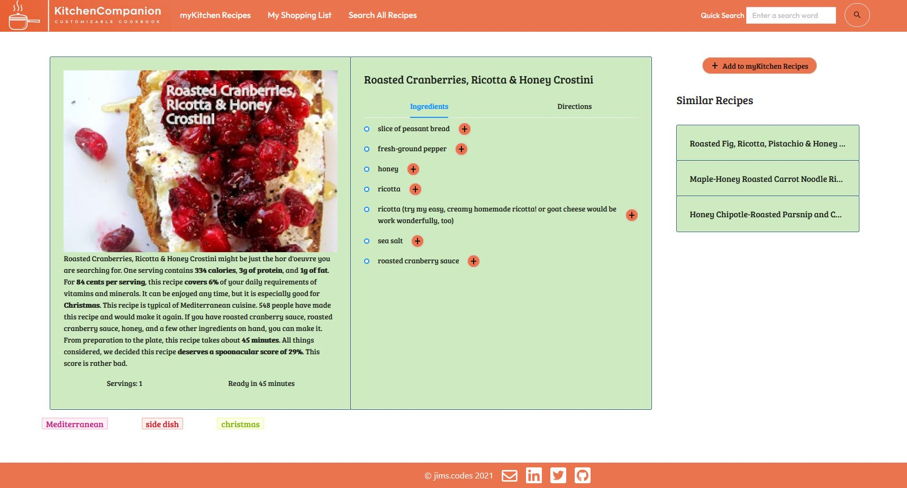

# KitchenCompanion Customizable Cookbook

helps you search for countless recipe ideas based on ingredients you have on hand to answer the dreaded question of "What am I going to make for dinner tonight?" Using KitchenCompanion, you can create custom searches through the Spoonacular API and favourite recipes so you can access them later at your convenience.

## Creator information

Creator: Jim Lougheed

Email: jims.codes@gmail.com

GitHub: https://github.com/jim-lougheed/

Twitter: https://twitter.com/JimsCodes

LinkedIn: https://www.linkedin.com/in/jim-lougheed/

## Available Scripts

In the project directory, you can run:

## In `client` folder

### `npm start`

This runs the app in the development mode.\
Open [http://localhost:3000](http://localhost:3000) to view it in the browser.

The page will reload if you make edits.\
You will also see any lint errors in the console.

### `npm test`

Launches the test runner in the interactive watch mode.

## In `server` folder:

### `node server.js`

Launches the server.

## Features

Each recipe retrieved by the API can be added to the user's list of favourited recipes.

The "What's in myKitchen?" sidebar allows the user to check the box of each food item they have on hand to filter recipes and use the Dinner Wheel.

The myKitchen Dinner Wheel picks 6 recipes that contain ingredients checked in "What's in myKitchen?" and randomly selects one that will take the decision factor out of selecting a recipe.

Similarly, the user can access a complete search of recipes containing ingredients checked in "What's in myKitchen?"

The user can also do an advanced search with many more search criteria.

A shopping list component allows users to keep track of ingredients they need but don't have on hand.

On each recipe page, users have access to a description, a list of ingredients (that can be added to their shopping list), a list of directions, and other relevant recipe information.

## Technologies Used

### [React](https://reactjs.org/)
Created with `create-react-app` using the React JS library.

### [spoonacular API](https://spoonacular.com/food-api)
Recipe API used for data retrieval of recipes.

### [mySQL](https://www.mysql.com/)
Stores user information and favourited recipes.

### [Knex.js](https://knexjs.org/)
Makes queries to and from mySQL database.

### [Ant Design](https://ant.design/)
Built with Ant Design UI framework components.

### [Winwheel.js](http://dougtesting.net/home)
Uses basic code wheel for random dinner recipe selector.

### [Node.js](https://nodejs.org/en/)
Runs server.

### [Express](http://expressjs.com/)
Express web framework for Node.js.

### [Axios](https://axios-http.com/)
Axios HTTP client makes API calls to spoonacular API.

### [SASS](https://sass-lang.com/)
CSS extension language used with BEM naming principles.

### [uniqid](https://www.npmjs.com/package/uniqid)
Creates unique IDs for recipes added to database.

## Roadmap

Future releases will include the following functionality:

User authentication and authorization

- The user will be able to create their own account with password encryption, and be able to save information to their profile, such as myRecipes, myShopping List, and dietary preferences that will be checked automatically in search components.

Recipe review scores and notes

- The user will be able to assign a score out of 5 stars to each recipe saved in myRecipes, as well as write any notes they would like to attach for when they next make it.

Posting new recipe to myRecipes

- The user will be able to upload their own recipe to be saved in myRecipes, which will include all the same information as other recipes, including image.

## Badges

https://img.shields.io/twitter/url?style=social&url=https%3A%2F%2Fimg.shields.io%2Ftwitter%2Furl%3Fstyle%3Dsocial%26url%3D%252Ftwitter%252FJimsCodes

https://img.shields.io/github/watchers/jim-lougheed/kitchen-companion?style=social

## Support

Contributions, issues, and feature requests are welcome!
Give a ⭐️ if you like this project!